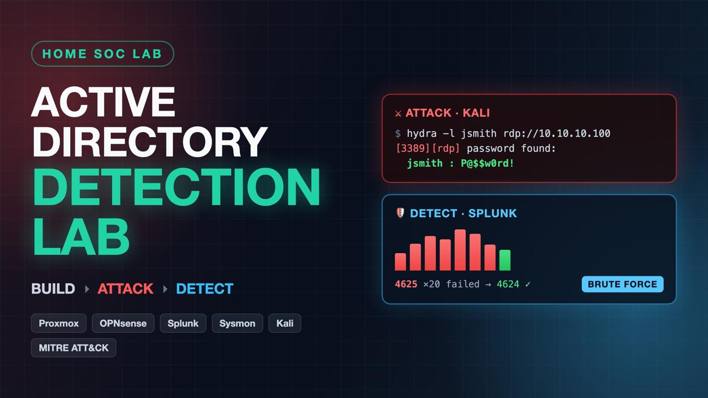
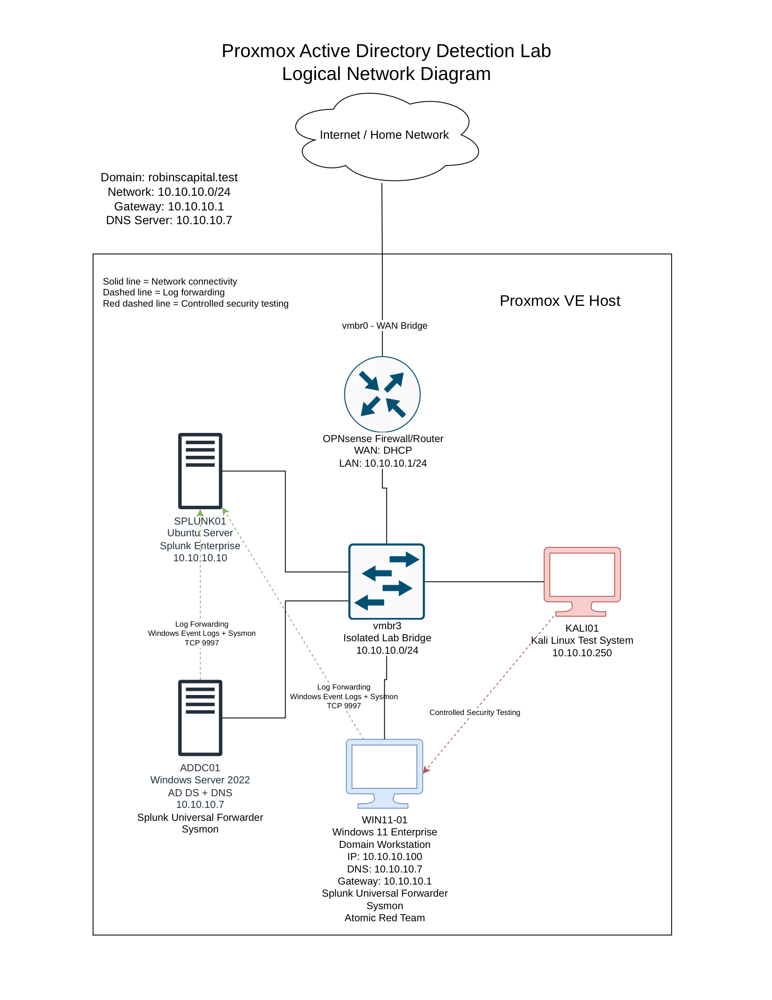
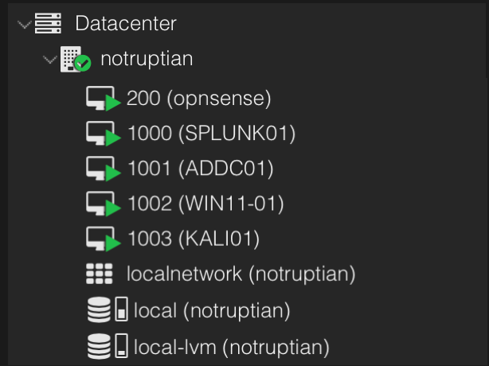
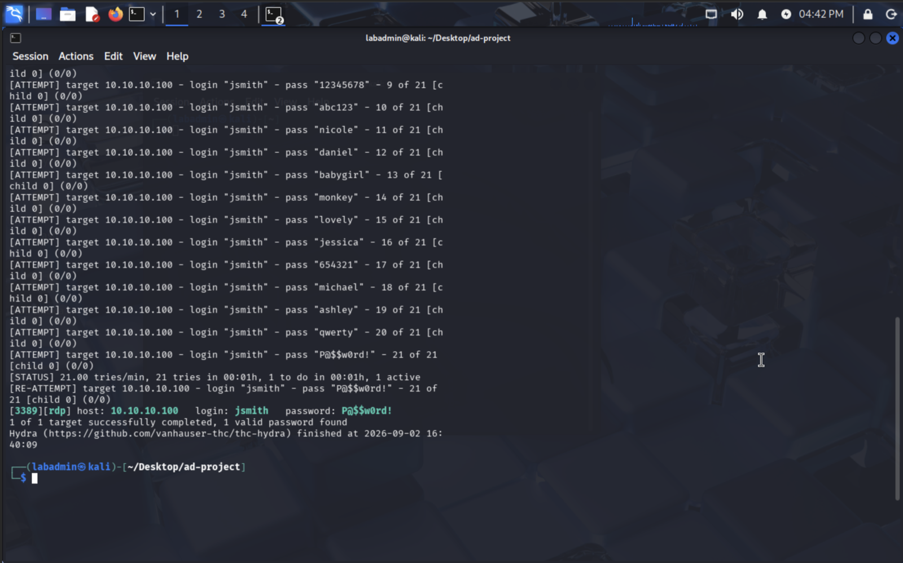
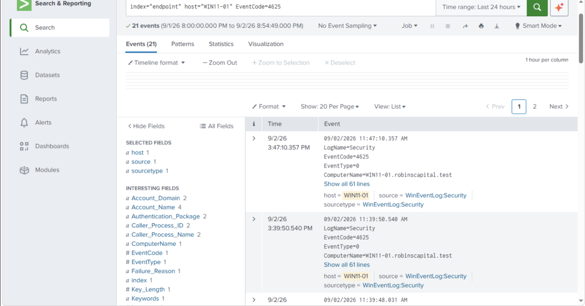
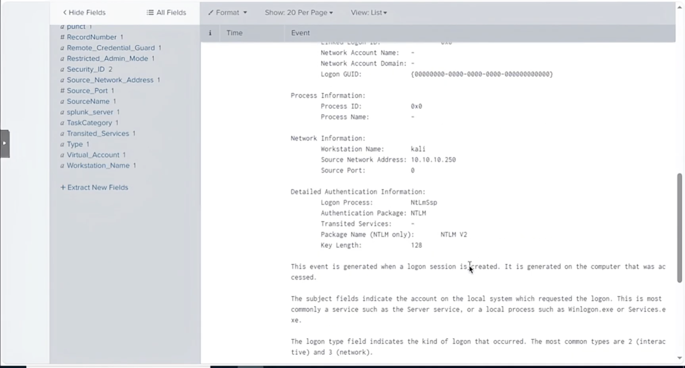

# Active Directory Detection Lab (Proxmox)

A home SOC / detection-engineering lab: a segmented Windows **Active Directory** environment on
**Proxmox VE**, behind an **OPNsense** firewall, with centralized **Splunk** logging of Windows +
**Sysmon** telemetry. I execute a controlled **RDP brute-force attack** from **Kali Linux**, detect it
in Splunk via **Windows Event IDs 4625/4624**, build an alert for it, and run **Atomic Red Team**
(mapped to **MITRE ATT&CK**) to find and close detection gaps.

> Adapted from the MyDFIR / [avulman active-directory-project](https://github.com/avulman/active-directory-project)
> and re-engineered from VirtualBox to a firewalled Proxmox architecture.

[](https://www.youtube.com/watch?v=Dr5MTGbbc5c)
*▶️ [Click to watch the full walkthrough on YouTube](https://www.youtube.com/watch?v=Dr5MTGbbc5c)*



---

## The workflow: Build → Attack → Detect → Close the gap

| # | Machine | Role | IP |
|---|---|---|---|
| 1 | OPNsense | Firewall / router (gateway, NAT, default-deny) | `10.10.10.1` |
| 2 | ADDC01 | Windows Server 2022 — AD DS + DNS | `10.10.10.7` |
| 3 | SPLUNK01 | Ubuntu — Splunk SIEM | `10.10.10.10` |
| 4 | WIN11-01 | Windows 11 domain workstation (target) | `10.10.10.100` |
| 5 | KALI01 | Kali Linux (attacker) | `10.10.10.250` |

All hosts sit on an isolated bridge (`vmbr3`, `10.10.10.0/24`); the only path out is through OPNsense.
**Domain:** `robinscapital.test`.

The five lab VMs running on the Proxmox host:



## Attack → Detection

**1. Attack** — an RDP credential brute force from Kali recovers a valid domain password using Hydra:



**2. Detect** — the attack surfaces in Splunk as a burst of **Event ID 4625** (failed logons) from a
single source, clustered within seconds — the brute-force signature:



**3. Attribute** — the follow-on **Event ID 4624** (successful logon) pins the compromise to the
attacker: `Workstation Name: kali`, `Source Network Address: 10.10.10.250`:



## Detection highlight

The saved Splunk detection turns that pattern into an automated alert — 5+ failed logons from one
source in a single minute:

```spl
index=endpoint host=WIN11-01 EventCode=4625
| bucket _time span=1m
| stats count by _time, Account_Name, Source_Network_Address
| where count >= 5
```

See [`config/detections.spl`](config/detections.spl) for all searches and [`config/inputs.conf`](config/inputs.conf)
for the forwarder configuration.

## Skills demonstrated

Active Directory administration · SIEM engineering (Splunk) · Detection engineering & alerting ·
Endpoint telemetry (Sysmon) · Log analysis (Windows Event IDs) · Network segmentation & firewalling ·
Adversary emulation (MITRE ATT&CK / Atomic Red Team) · Offensive security (credential attacks) ·
Virtualization (Proxmox) · Incident investigation

## Tech stack

Proxmox VE · OPNsense · Windows Server 2022 · Windows 11 · Ubuntu Server · Splunk Enterprise +
Universal Forwarder · Sysmon · Kali Linux · Hydra · Atomic Red Team · MITRE ATT&CK · PowerShell

## Repo contents

| Path | What |
|---|---|
| **[BUILD-GUIDE.md](BUILD-GUIDE.md)** | Full step-by-step build — per-VM Proxmox wizard settings and every install. |
| [config/inputs.conf](config/inputs.conf) | Splunk Universal Forwarder input config (Windows + Sysmon → `endpoint` index). |
| [config/detections.spl](config/detections.spl) | Splunk searches + the brute-force alert. |
| [logical-network.png](logical-network.png) | Architecture diagram. |
| [screenshots/](screenshots/) | Evidence screenshots from the build/attack/detection. |

## Notes / gotchas solved during the build

- **Crowbar is deprecated on modern Kali** (FreeRDP 3) → used **Hydra** instead.
- **Kali installer blocked by Secure Boot** → created the EFI disk without pre-enrolled keys.
- **Windows 11 retail ISO has no Enterprise edition** → installed **Pro** (Home can't join a domain).
- **Domain join requires the workstation's DNS to point at the DC** (`10.10.10.7`), not the firewall.
- **RDP attack needs the target user in "Remote Desktop Users"**, and watch for **account lockout**.

---

*Lab use only. Everything runs in an isolated environment I own. Never point these tools at systems you
don't have explicit permission to test.*
